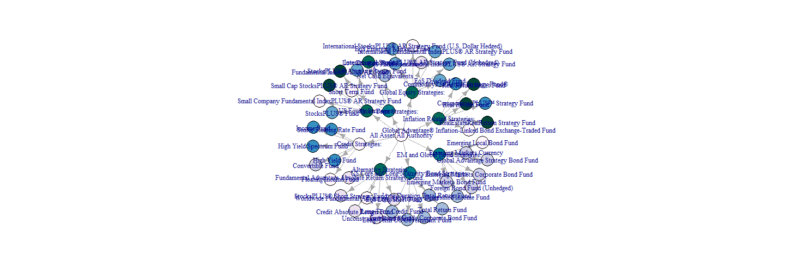

```r
# sankey of PIMCO All Asset All Authority holdings data source
# http://investments.pimco.com/ShareholderCommunications/External%20Documents/PIMCO%20Bond%20Stats.xls

require(rCharts)
```

```
## Loading required package: rCharts
```

```r

# originally read the data from clipboard of Excel copy for those
# interested here is how to do it read.delim(file = 'clipboard')

holdings = read.delim("holdings.txt", skip = 3, header = FALSE, stringsAsFactors = FALSE)
colnames(holdings) <- c("source", "target", "value")

# get rid of holdings with 0 weight or since copy/paste from Excel -
holdings <- holdings[-which(holdings$value == "-"), ]
holdings$value <- as.numeric(holdings$value)

# now we finally have the data in the form we need
sankeyPlot <- rCharts$new()
sankeyPlot$setLib(".")
sankeyPlot$setTemplate(script = "layouts/chart.html")

sankeyPlot$set(data = holdings, nodeWidth = 15, nodePadding = 10, layout = 32, 
    width = 750, height = 500, labelFormat = ".1%")

sankeyPlot
```


```r
require(igraph)
```

```
## Loading required package: igraph
```

```r
require(RColorBrewer)
```

```
## Loading required package: RColorBrewer
```

```r
g <- graph.data.frame(holdings)
V(g)$color = brewer.pal("PuBuGn", n = 9)[as.numeric(factor(holdings$source))]
```

```
## Warning: number of items to replace is not a multiple of replacement
## length
```

```r
plot(g, vertex.color = V(g)$color)
```

 


```r
# get holdings ready for a bar chart

holdings.bar <- holdings[-which(holdings$source == "All Asset All Authority"), 
    ]
holdings.bar$source <- factor(holdings.bar$source)
holdings.bar$target <- factor(holdings.bar$target, levels = holdings.bar$target, 
    ordered = TRUE)
require(ggplot2)
```

```
## Loading required package: ggplot2
```

```r

ggplot(data = holdings.bar, aes(x = target, y = value, fill = source)) + geom_bar(stat = "identity", 
    position = position_dodge()) + coord_flip()
```

 

